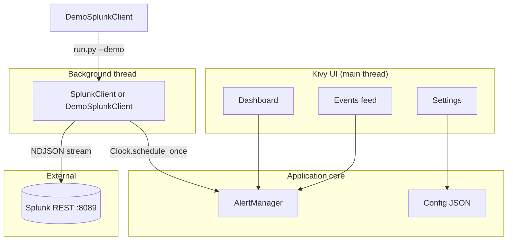

# SIEM-Mobile - Pocket SOC Dashboard for Splunk

**Topic (Seargin Summer Internship):** SIEM & Log Analysis - log aggregation, event correlation, severity classification.

A proof-of-concept **mobile-style SOC console** built in Python + Kivy. It polls Splunk REST API for Sysmon events, classifies them as CRITICAL / WARNING / INFO using rule-based detection, and shows a clean dashboard with searchable alert feed, event detail view, and settings.


**Live demo (video):** https://www.youtube.com/watch?v=d8IrlOPYAMc

---

## Product description

Security analysts cannot carry the full Splunk Web UI in their pocket. **SIEM-Mobile** gives the on-call SOC engineer a focused, mobile-friendly view of Splunk Sysmon data with:

- Live polling of Splunk via `/services/search/jobs/export` (REST, port 8089)
- Rule-based correlation: encoded PowerShell, IEX downloads, mimikatz, log clears, LOLBins, suspicious `cmd /c`
- Three-tier severity classification (CRITICAL / WARNING / INFO) with burst de-duplication
- Searchable alert feed with filters, copy-command, JSON export
- Offline demo mode for presentations without a Splunk lab

---

## Quick start - one command

| Goal | Command |
|------|---------|
| **Live demo without Splunk** | `python run.py --demo` |
| **Production** (Splunk required) | `python run.py` |
| Windows (cmd / double-click) | `run.bat --demo` |
| PowerShell | `.\run.ps1 -Demo` |
| Linux / macOS | `chmod +x run.sh && ./run.sh --demo` |

`run.py` automatically creates `.venv`, installs `requirements.txt`, then launches the UI. No manual setup.

```bash
git clone https://github.com/xNikkO/SIEM-Mobile-test.git
cd SIEM-Mobile-test
python run.py --demo
```

---

## Setup instructions

### Option A - Demo mode

```bash
python run.py --demo
```

- Auto-monitor ON, synthetic CRITICAL / WARNING / INFO events every ~10 s
- No Splunk, no Sysmon, no credentials needed

### Option B - With Splunk Enterprise or Free

1. Splunk listening on port **8089** with Sysmon events forwarded into any index (default rule looks for `Microsoft-Windows-Sysmon` and EventID 1 / 1102).
2. On **Splunk Free**: enable remote REST login in `etc/system/local/server.conf`:
   ```ini
   [general]
   allowRemoteLogin = always
   ```
   then restart Splunk. Free has no user accounts, so leave Username / Password blank in SIEM-Mobile.
3. Run:
   ```bash
   python run.py
   ```
4. Open **SETTINGS** -> set Splunk URL (`https://<host>:8089`), optional user/password -> **TEST CONNECTION** -> **SAVE**.
5. Open **DASHBOARD** -> enable **Auto-monitor** or click **REFRESH NOW**.

Local config is stored at `~/.siem_mobile/config.json`.

### Requirements

| Component | Version |
|-----------|---------|
| Python | 3.9+ |
| Kivy | 2.3+ |
| requests | 2.31+ |
| urllib3 | 2.0+ |
| plyer (optional, desktop notifications) | 2.1+ |

---

## Architecture overview



**Threading model:** All HTTP runs on a `SplunkPoller` daemon thread. The UI is only updated through `Clock.schedule_once` on Kivy's main loop, so the dashboard never blocks during a poll or a stream timeout.

**Detection pipeline:**

1. `SplunkClient.query_once` streams `jobs/export` (NDJSON).
2. Each row is parsed: native fields first, then Sysmon XML in `_raw` is extracted (`EventID`, `CommandLine`, `ParentCommandLine`, `Image`, etc.) - this is what lets the app work even on **Splunk Free without the Windows add-on**.
3. `Alert._match_rules()` runs ordered regex rules (encoded PS, IEX, mimikatz, vssadmin, schtasks, ...).
4. `AlertManager.add()` de-duplicates by host + name + severity + normalized command line (90 s burst window) and pushes the alert to the UI listeners.

---

## Project layout

```
SIEM-Mobile-test/
├── run.py              # single entry point (creates venv, installs deps, launches app)
├── run.bat / run.ps1 / run.sh
├── main.py             # Kivy SiemApp, top header, bottom nav, polling glue
├── requirements.txt
├── LogoSIEM.png
└── app/
    ├── config.py           # Config + DEFAULT_SPL
    ├── splunk_client.py    # REST poller, auth, NDJSON stream
    ├── demo_mode.py        # DemoSplunkClient (offline synthetic events)
    ├── alert_manager.py    # Alert, AlertManager, rule definitions
    ├── theme.py            # Colors / fonts / radii
    ├── ui_components.py    # Buttons, pills, cards, AppLogo, MonoLogLabel
    └── screens/
        ├── dashboard.py
        ├── alert_log.py
        └── settings.py
```

---

## Core features (end-to-end)

1. **Connect** - test Splunk REST endpoint or fall back to demo backend
2. **Ingest** - poll a user-editable SPL query on a configurable interval (auto-widens too-narrow time windows like `-1m` to `-1h` to compensate for forwarder lag)
3. **Classify** - severity + named rule from CommandLine / ParentCommandLine / ScriptBlockText context (parsed from Sysmon XML)
4. **Act** - dashboard counters, severity filters, full event JSON view, copy command line, export

---

## Known limitations

- **Splunk is optional only in `--demo` mode**; production needs a reachable Splunkd on 8089 with Sysmon being indexed.
- SSL verification is disabled (`verify=False`) so the app works against self-signed home-lab Splunk - **not production safe**, would be replaced with a CA bundle.
- Splunk credentials are stored in plain JSON under `~/.siem_mobile/config.json` (lab trade-off; would move to OS keychain via `keyring` for production).
- Desktop-first (Kivy). Android build is possible via Buildozer but not included in this PoC.
- Correlation is rule-based regex, not ML; tuned for Sysmon process-create patterns and log clearing. Adding new rules means editing `_DETECTION_RULES` in `app/alert_manager.py`.
- Burst de-duplication collapses multiple Sysmon rows produced by one script into a single alert (by design - reduces alert fatigue).
- On Splunk Free without the Windows add-on, the app parses Sysmon XML directly from `_raw` (CIM field extraction is not available); searches use full-text `"<EventID>1</EventID>"` style matching rather than the indexed `EventCode` field.

---

## License

Educational / internship PoC - free to read and learn from.
